# Wiki
# Dica: atalho para rodar script _Javascript_:

/*
 * Script de exemplo para printar msg na tela
 * rodar código Js no VS code :
 * Ctrl+Alt+N, por baixo ele chama o _node_
 * 
 */
```
console.log('Teste')
```
## Comentário no JS
```
/*
 * Multiple
 * Lines
 * JS
 * Comment
 */
 ```

 ## Dicas VS CODE:
 Teclas de atalho VS CODE
SHIFT_TAB, ajuste de espaço das linhas, somente TAB, vai para frente

ALT+SHIFT+BAIXO, duplica linhas
CTRL + X, exclui linha.

## Dicas de _DOCKER_:

Para verificar as versões do Docker, git, Node.js e npm instaladas em seu computador, execute o comando docker --version && git --version && node --version && npm --version no seu terminal de linha de comando.

Com o docker rodando em seu computador, execute o comando docker run --publish 80:80 --publish --hostname localhost wlsf82/gitlab-ce e aguarde até o ambiente inicializar.

## Dicas de _PROMPT_ DE COMANDO (DOS):

## Exibir pastas e criar pastas
## Dir
dir exibir pastas
cd acessar uma pasta
mkdir criar uma pasta

## Power Shell
Para abrir o power Shell em uma pasta use tecla windows + shift e clique
botão direito em qualquer lugar da pasta e secione abrir janela do power Shell aqui.

Como estamos no PowerShell, os comandos do Linux também funcionam. O comando equivalente ao “dir” no Linux é o “ls”, então também podemos usá-lo.

Podemos usar o comando “cd ..” para retornar uma pasta atrás da atual. 

Esse comando é sempre o mesmo, você pode usá-lo sempre que quiser ir para a pasta anterior.

## Clear
Outro comando super interessante é o “cls” ou “clear”. Ele limpa todos os comandos listados, melhorando a visualização no terminal. Lembrando que ele limpa apenas os comandos, nenhum efeito de comando anterior é perdido.

## MKDIR
Você também pode criar uma nova pasta a partir do terminal com o comando “mkdir”. No exemplo a seguir, usei o “dir” para mostrar as pastas contidas na pasta “Projetos”, criei uma nova pasta, mostrei novamente as pastas com o “dir”, para mostrar que foi adicionada uma nova pasta lá, e entrei na pasta recém criada com o comando “cd”.

## Del
 del + nome da pasta/arquivo
Você pode também apagar arquivos e pastas com o comando “del + nome da pasta/arquivo”. 

## Help
Um outro comando super válido de se utilizar é o ‘help’, pois ele lista todos os comandos que você pode utilizar. É muito bom para quem não quer ir pesquisar em outro local sobre os demais  comandos do terminal. Basta utilizar o comando ‘help’ dentro dele mesmo e pronto!

## Dicas _Cypress_:
- `npm i cypress --save-dev`: Faz a instalação do Cypress.
- **npm  init**: Inicia um projeto em uma pasta.
- **npx cypress open:** Comando para rodar o teste.
- **npm run test:** Abre o Script de testes

## Estrutura do código Cypress
- **Describe:** ele é uma função que contém dois argumentos, o primeiro argumento é o nome da switch de teste, o segundo é uma função onde posso executar qualquer coisa dentro, nessa primeira orientação temos o **beforeEach**: comando que vai ser executado antes de cada caso de teste.
- **cy.visit('https://example.cypress.io/todo'):** Abre a tela inicial da aplicação.
- **it('displays two todo items by default', () =>: IT** é de item de teste.
- **Cy.Get E Should:** para obter o elemento e should para fazer a verificação.

## [Encadeamento de comandos](https://docs.cypress.io/guides/core-concepts/introduction-to-cypress#Chains-of-Commands)

No Cypress, diferente de outras ferramentas de automação de testes, a maioria dos comandos são encadeáveis.

Ou seja, em vez de você armazenar o retorno de um `cy.get()` em uma variável para posterior uso, você encadeia comandos ao mesmo, tal como um `.should()`, `.type()` ou `.click()`.

Por exemplo: `cy.get('input[type="text"]').type('Olá mundo!')`.

Porém, a coisa não pára por aí.

O comando `cy.get()` passa adiante ao próximo comando o elemento encontrado, e outros comandos, tais como o `.type()` e `click()` (dentre outros), também passam adiante o mesmo elemento, possibilitando encadearmos novos comandos, por exemplo, para fazer uma verificação.

Algo como o seguinte:

`cy.get('input[type="text"]')
  .type('Olá mundo!')
  .should('have.value', 'Olá mundo!')`

Poderíamos até mesmo ir além, e antes de digitar no campo, garantir (explicitamente) que tal elemento está visível, antes da digitação (veja abaixo).

`cy.get('input[type="text"]')
  .should('be.visible')
  .type('Olá mundo!')
  .should('have.value', 'Olá mundo!')`

Agora que você já leu a documentacão oficial do Cypress sobre os comandos `cy.get()`, `.type()` e `.click()`, e você também já entendeu sobre as re-tentativas e encadeamento de comandos.

# Github

## Parte 1: primeiros passos no GIT

## Configuração inicial:

- GIT CONFIG   - -GLOBAL [USER.NAME](http://USER.NAME) “SEU NOME”. Cria usuário;
- GIT CONFIG   - -GLOBAL [USER.EMAIL](http://USER.EMAIL) “MEU@EMAIL.COM”. Vincula email no git.
- GIT CONFIG   - -GLOBAL CORE.EDITOR “NOME DO EDITOR DE TEXTO”

## Comandos de consulta:

- GIT CONFIG [USER.NAME](http://USER.NAME): Exibe nome de usuário.
- GIT CONFIG - -LIST : Exibe todos os dados do usuário GIT.

## Iniciando um repositório no git:

- MKDIR : Cria uma pasta em um repositório.
- CD : Acessa uma pasta.
- LS  -LA : Exibe uma lista de itens de uma pasta.
- GIT INIT: Inicializar um repositório GIT.
- LS -LA   ~/.SSH : Verificar chaves existentes.
- SSH-KEYGEN -T ed25519 -C “meu_email@exemplo.com”
- CLIP < ~/.SSH/ID_ed25519.pub: Faz uma cópia da chave para inserir no seu Git.
- SSH -T GIT@GITHUB.COM: Testa conexão com Git.
- GIT REMOTE ADD ORIGIN GIT@GITHUB.COM:MEUUSER/NOMEDAPASTA.GIT: Faz a conexão do repositório remoto com o repositório local.
- GIT PUSH ORIGIN -U MASTER: Sobe todo o Git que está na pasta para o repositório remoto.h config
- GIT PULL : Traz tudo que está no repositório remoto.
- GIT PUSH : Faz o caminho contrário, envia tudo que está no repositório local para o repositório remoto. Obs: ele só ira enviar o que está comitado.
- GIT CHECKOUT -B NOMEDOBRANCH: Cria um novo Branch.
- GIT CHECKOUT “TESTE”: Vai para Branch informado.
- 

echo "# Estudos_APIS" >> [README.md](http://readme.md/)
git init
git add [README.md](http://readme.md/)
git commit -m "first commit"
git branch -M main
git remote add origin [git@github.com](mailto:git@github.com):Fabricioperrone/Estudos_APIS.git
git push -u origin main

```
git remote add origin git@github.com:Fabricioperrone/Estudos_Github.gitgit branch -M main
git push -u origin main
```


# Linux

## Comandos:

**MÓDULO 1**:

- PWD: Sabermos em que diretório estamos;
- MAN : Para abrirmos o Manual de alguns comandos;
- LS ou LAH: Listar o conteúdo de um diretório;
- CD: Para navegar entre diretórios;
- MKDIR: Cria um diretório;
- MKDIR -P : criamos uma árvore de diretórios. Exemplo: mkdir terminal2/comandos.
- TOUCH: Cria um arquivo;
- O comando TOUCH também serve para darmos update nos times temp(atualizar). Exemplo: touch arquivo.txt
- CP (CP -R: Para copiar diretórios): Para copiar um arquivo/diretório.
- MV: Para mover um arquivo ou um diretório;
- RM: Para remover um arquivo ou um diretório;
- EXIT: Encerramos o terminal.
    
    
    ## Módulo II: Comandos de edição e gestão de arquivos
    
    - APT: Instalar e desinstalar programas;
    - TREE: Listar uma pasta no formato mais visual;
    - VI ou VIM: Editor de arquivo no terminal;
    - CAT: Ler e jogar na tela o conteúdo de um arquivo;
    - | (PIPE): Para redirecionar a saída de um comando;
    - MORE: Gerar uma pausa entre telas;
    - TAIL: Ler e exibir o fim de um arquivo;
    - HEAD: Ler e exibir o inicio de um arquivo;
    - GREP: Procurar por um termo em um arquivo/conteúdo;
    - EGREP: Procurar um arquivo por um termo ( com conteúdo regular) em um arquivo /conteúdo;
    - TAR:  Gerar um arquivo único de vários arquivos/diretórios (zipados ou não;
    - ZIP: Compactar um arquivo/pasta.
- 

### Módulo III: Comandos de rede e processos

- IFCONFIG: Para nossas configurações de rede;
- IP -A: Obter informações de IP;
- PING: Testar conectividade com um endereço remoto;
- TELNET: Testar conectividade com um endereço remoto com a porta;
- SSH: Conectar em um linux remoto;
- NETSTAT: Verificar o status da rede;
- DF: Verificar Espaço em disco;
- DU: Verificar espaço utilizado pelos arquivos/pastas;
- TOP: Verificar processos e carga de processamento;
- PS: Listagem de processos;
- KILL: Forçar encerrar um processo;
- ENV. Verificar as variáveis de ambiente em um linux.

# Regex
Script para consultar CPF
```
\d{3}\.?\d{3}\.?\d{3}[-.]?\d{2}
```
## Resultado:

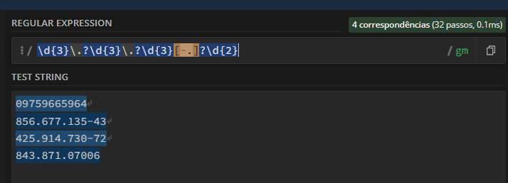

## Help
### Expressões Regulares e classes

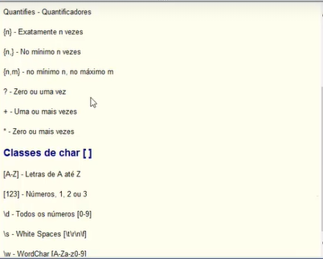

- Link exemplo: https://regex101.com/r/OEjCA1/1

## REGEX

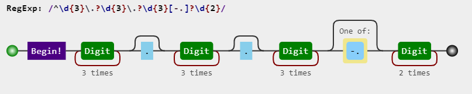

## Massa de dados CPF

- 09759665964
- 856.677.135-43
- 425.914.730-72
- 843.871.07006

## REGEX para consultar datas:

Os gatos fazem aniversário em: 21 de Dezembro de 1988, 13 de julho de 1988, 15 de março de 1999.

- Consulta  com parametro dia dos mês: [123][1-9] -> definem o dia do mês.
- Consulta com espaços para ignorar possíveis espaços no texto consultado.
Exemplo:

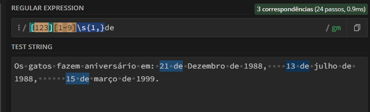

## Código:
```
[123][1-9]\s{1,}de
```
Outra forma de fazer a mesma coisa só que mais bonito!!!

```
[123][1-9]\s+de
```
## Resultado:

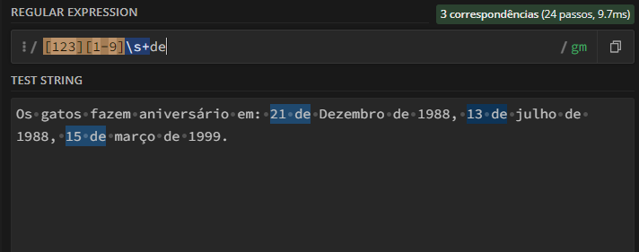

## Regex datas:

## Código:
```
[123][1-9]\s+(de\s+)?[a-z][a-zç]{4,8}\s+(de\s+)?[1-2]\d{3}
```

## Resultado:

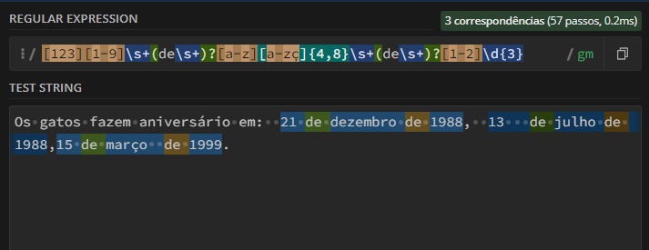

## Regulex:

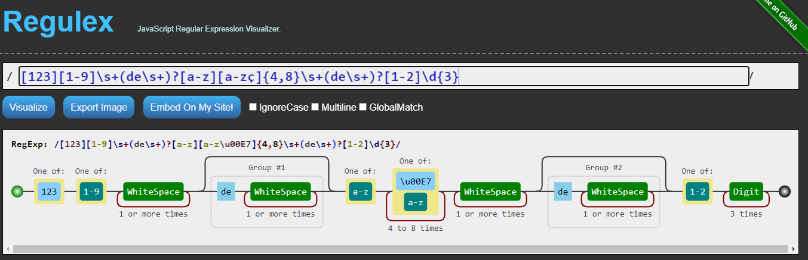

## Validando uma URL com Regex:

## Exemplo:

```
http:www\.\w+\.org
```
## Resultado:

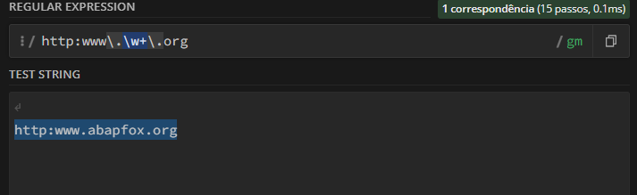

## Regulex

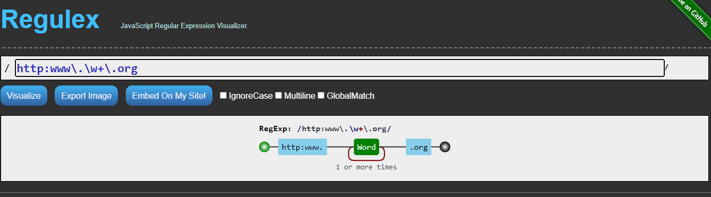

## Tags regex:
```
<(h1|h2).+>(\w+\s\w+)?
```

## Resultado:

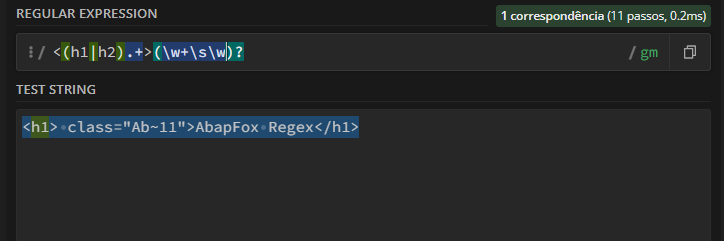

## Rubular
## Editor de expressões

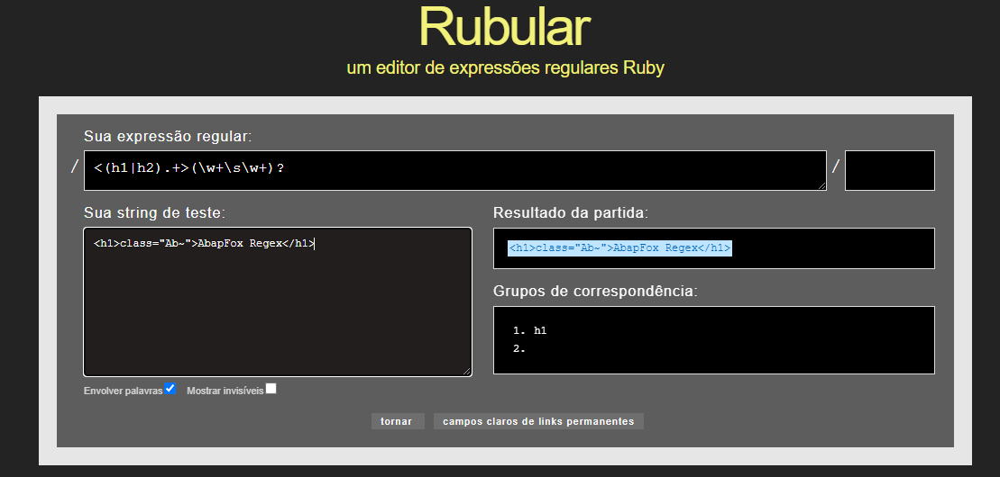
https://rubular.com/

## Código em SQL

- REGEX Expressões regulares em consultas
- Usando o REGEXP
select Nome_Livro from tbl_livro
where Nome_Livro regexp '^[FS]';- Conjunto de caracteres. ^ significa, inciando com umas que esta dento do conjunto

```
select Nome_Livro from tbl_livro
where Nome_Livro regexp '^[^FS]';-- ^ significa para não usar o que esta dentro do colchetes
```
```
select Nome_Livro from tbl_livro
where Nome_Livro regexp '[ng]$';-- procura livros que termninem com essa letras
```
```
select Nome_Livro from tbl_livro
where Nome_Livro regexp '^[FS]|Mi';-- busca com os livros que tenham as letras FS ou Mi
```